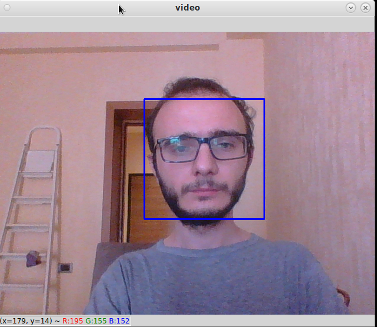
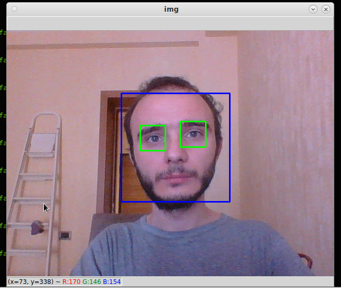

# Setup

```
virtualenv venv
git clone [THIS_REPO_URL]
cd src && pip install -r requirements.txt
```

# Train

```
python train.py
```

Cat face detection 

```
python cat_face_detection.py
```


Human face detection from live video 

```
python live_face_detection.py
```



Face and eye detection from live video 

```
python face_and_eye_detection.py
```



Face recognition & tagging on videos

```
python test_face_recog_on_video.py
# Produces undefined behaviour with qt5 
```


